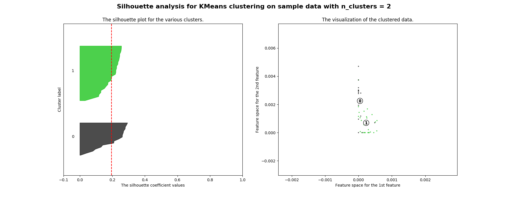
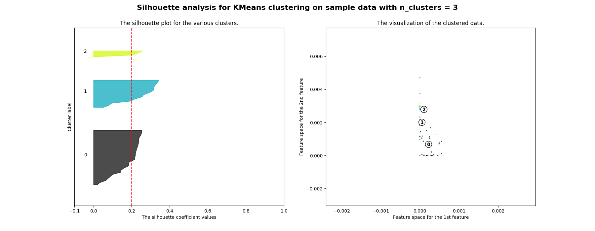
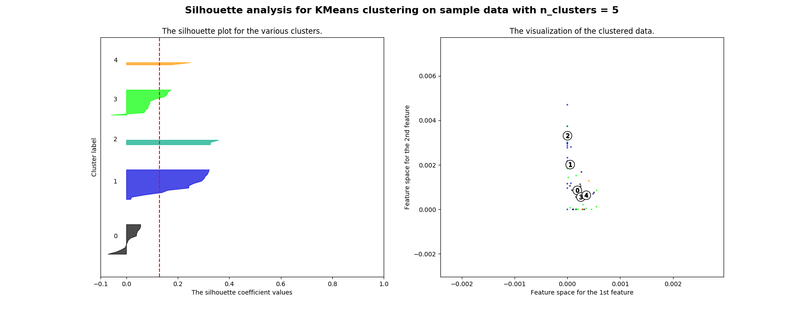
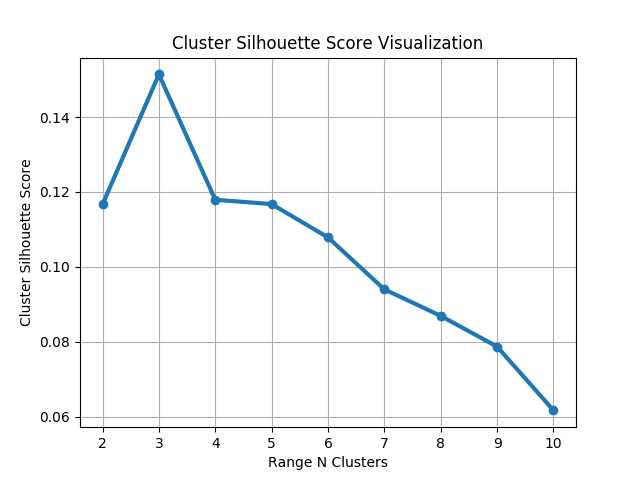
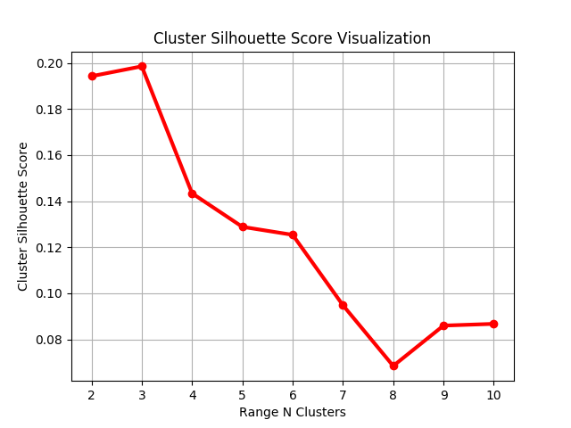

# This project involves four tasks

1. Engineer the image features
2. Apply a clustering algorithm using the extracted features
3. Determine the best number of clusters
4. Plot result and save result individually with clustered number

Let&#39;s go through these tasks one by one.

## 1. Engineer the image features

Convolution Nerual Network is the best tool to extract features from images.  Images are a bunch of pixels.  A certain set of pixels may represent an edge or other pattern of a image.  A convolution multiplies a matrix of pixels with a filter matrix and sums all the multiplication result.  After several layers of neural network, convolution is able to identify images.

In this project, two pre-trained models, DenseNet201 and ResNet50 in Keras are experimented to extract features.

- VGG was proposed by Visual Geometry Group.  DenseNet201 represents a VGG model with 16 weight layers.
- ResNet refers Residual Network.  In residual learning, the model learn residual instead of features.  Residual can be understood as subtraction of feature learned from input of that laryer.  ResNet50  represents a Residual Network with 50 layeres.

The input layer requires an image in the size of 224 x 224.  The 5011 images provided are not in this size format, therefore we have to resize all the images before we pass into the input layer.

The output layer is a softmax prediction on 1000 classes.  As we do NOT want CNN model to classify our images into their 1000 classes, we have to set the argument **include\_top** to False.  Without the top 3 fully-connected layers, the result can be used as features.

## 2. Apply a clustering algorithm using the extracted features

K-Means is chosen in this project.  The features extracted from CNN network cannot be used directly.  It has to be flatten or squeeze into one dimension array first.

## 3. Determine the best number of clusters

Silhouette coeffecient is the best evaluation matrix.  The figure closest to 1 represents the samples are very close within one cluster while having large distance apart from the sample in other clusters.  Experiments have to be run for different number of clusters.  The number of cluster with the largest silhouette score is chosen.

## Expreiment 1: include\_top = True VS include\_top = False (Feature space)

- Include\_top = True

After going through the 3 fully-connected layers, the features are dense in the space.

- Include\_top = False

The features are scattered through-out the space.

## Expreiment 2: include\_top = True VS include\_top = False (Silhouette coefficient)

- Include\_top = True

519 clusters obtain the highest sihouette coefficient.  It is not surprising as the &quot;features&quot; extracted actually are classified into pre-defined classes already.  By looking at the clustering result, the images in the same cluster are more likely refers to the same object.

- Include\_top = False

The best choise of clusters is 3.

## Expreiment 3: ResNet Vs DenseNet201

The best number of clusters is 3.  

  
  
  

